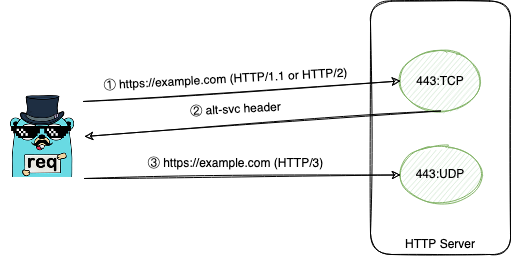

## Official Announcement

req currently officially supports HTTP3, you can update req to the latest version:

```bash
go get -u github.com/imroc/req/v3
```

## Enable HTTP3

Call the client's `EnableHTTP3()` to enable HTTP3 support. After enabling, req will automatically detect whether the server supports HTTP3 to decide whether to use the HTTP3 protocol: first normally initiate `HTTP/2` or `HTTP/1.1` requests (using TCP). During the request, if it is detected that the server supports `HTTP/3`, then all subsequent requests will use the `HTTP/3` protocol (using UDP). The detection process does not block any request and does not affect performance.

```go
package main

import (
  "github.com/imroc/req/v3"
)

func main() {
	client := req.C().EnableDebugLog().EnableHTTP3()
  // client.EnableDumpAll() // uncomment this to see all dump content.

  for i := 0; i < 4; i++ {
    client.MustGet("https://www.cloudflare.com")
  }
}
```

From the output of the debug log, it can be seen that the server supports HTTP3 is detected after the second request, and the subsequent requests are switched to the HTTP3 protocol:

```
2022/07/11 10:37:52.876009 DEBUG [req] HTTP/2 GET https://www.cloudflare.com
2022/07/11 10:37:53.029690 DEBUG [req] HTTP/2 GET https://www.cloudflare.com
2022/07/11 10:37:53.122675 DEBUG [req] detected that the server www.cloudflare.com:443 supports http3, will try to use http3 protocol in subsequent requests
2022/07/11 10:37:53.171431 DEBUG [req] HTTP/3 GET https://www.cloudflare.com
2022/07/11 10:37:53.440928 DEBUG [req] HTTP/3 GET https://www.cloudflare.com
```

## Force HTTP3

If you want to force using HTTP3 protocol, you can call the client's `EnableForceHTTP3()`:

```go
package main

import (
  "github.com/imroc/req/v3"
)

func main() {
	client := req.C().EnableDebugLog().EnableForceHTTP3()
  // client.EnableDumpAll() // uncomment this to see all dump content.

  for i := 0; i < 4; i++ {
    client.MustGet("https://www.cloudflare.com")
  }
}
```

From the debug log, we can see that all requests are using the HTTP3 protocol:

```txt
2022/07/11 14:51:31.494027 DEBUG [req] HTTP/3 GET https://www.cloudflare.com
2022/07/11 14:51:31.822586 DEBUG [req] HTTP/3 GET https://www.cloudflare.com
2022/07/11 14:51:31.884925 DEBUG [req] HTTP/3 GET https://www.cloudflare.com
2022/07/11 14:51:31.938934 DEBUG [req] HTTP/3 GET https://www.cloudflare.com
```

## HTTP multi-protocol version and automatic detection principle

Although the HTTP3 protocol itself has been officially released, it is still far from universal (many sites don't even support HTTP2 yet). For many years, multiple HTTP protocol versions will coexist.

From the perspective of the server, of course, we hope to maximize the compatibility of various clients. If the server side supports `HTTP/2` will generally support `HTTP/1.1` at the same time, if the server side supports `HTTP/3` will generally also support `HTTP/2` at the same time.

From the perspective of the user, of course, we hope to use newer protocols for better performance and enhanced functionality.

As a "smart" Go HTTP client that supports multiple HTTP protocols, req can automatically detect the server side and select the optimal HTTP version for requests.

So how does req do it? In fact, it is the same as the browser judgment principle. The principle is explained in detail below.

Since both `HTTP/2` and `HTTP/3` are based on TLS, sites using `http://` only use the `HTTP/1.1` protocol.


So does a site using `https://` go `HTTP/1.1`, `HTTP/2` or `HTTP/3`?

For `HTTP/2` and `HTTP/1.1`, the network transport layer uses the TCP protocol, while `HTTP/3` is the UDP protocol. Sites that support `HTTP/3` generally also support `HTTP/2` or `HTTP/1.1`, which means that they listen to both the UDP and TCP protocols. Since most sites on the Internet currently use `HTTP/1.1` and `HTTP/2`, for compatibility reasons, req will first use TCP to connect to the server and perform a TLS handshake, and if the server ALPN responds with the negotiated HTTP protocol version during the TLS handshake, the client will use the negotiated protocol version, but this is generally only for `HTTP/1.1` and `HTTP/2`, because it uses the TCP, even if ALPN negotiates to use `HTTP/3`, it needs to re-establish a new UDP connection and TLS handshake, which affects the performance, so if the server supports `HTTP/3`, it usually does not negotiate to `HTTP/3` in the TLS handshake of TCP, but first negotiates to `HTTP/2` to complete the current request, and then inform the client that `HTTP/3` is supported in the `alt-svc` response header (see [RFC9114 - HTTP Alternative Services](https://www.rfc-editor.org/rfc/rfc9114.html#name-http-alternative-services)), and finally the client will try to connect to the `HTTP/3` address indicated in `alt-svc` using UDP and perform a handshake, and if successful, subsequent requests with the same `host+port` will use the `HTTP/3` protocol.



## Next Step

Trace is not supported yet in HTTP3, but will be supported in the future.
