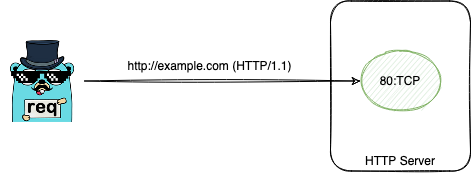

## 正式官宣

req 当前已正式支持 HTTP3，您可以更新 req 到最新版:

```bash
go get -u github.com/imroc/req/v3
```

## 启用 HTTP3

调用 client 的 `EnableHTTP3()` 来启用 HTTP3 的支持，启用后，req 会像浏览器一样，自动检测服务端是否支持 HTTP3 来决定是否使用 HTTP3 协议: 先正常发起 HTTP2 或 HTTP/1.1 请求（走 TCP）。在请求过程中，如果检测到服务器端支持 HTTP3，那么后续的所有请求都会使用 HTTP3 协议（走 UDP）。检测过程不会阻塞任何请求，不影响性能。

```go
package main

import (
  "github.com/imroc/req/v3"
)

func main() {
	client := req.C().EnableDebugLog().EnableHTTP3()
  // client.EnableDumpAll() // uncomment this to see all dump content.

  for i := 0; i < 4; i++ {
    client.MustGet("https://www.cloudflare.com")
  }
}
```

从 debug 日志的输出可以看出，第 2 次请求后探测出了服务端支持 HTTP3，后续请求切换到 HTTP3 协议:

```
2022/07/11 10:37:52.876009 DEBUG [req] HTTP/2 GET https://www.cloudflare.com
2022/07/11 10:37:53.029690 DEBUG [req] HTTP/2 GET https://www.cloudflare.com
2022/07/11 10:37:53.122675 DEBUG [req] detected that the server www.cloudflare.com:443 supports http3, will try to use http3 protocol in subsequent requests
2022/07/11 10:37:53.171431 DEBUG [req] HTTP/3 GET https://www.cloudflare.com
2022/07/11 10:37:53.440928 DEBUG [req] HTTP/3 GET https://www.cloudflare.com
```

## 强制使用 HTTP3

如果希望强制指定使用 HTTP3 协议，可以调用 client 的 `EnableForceHTTP3()`:

```go
package main

import (
  "github.com/imroc/req/v3"
)

func main() {
	client := req.C().EnableDebugLog().EnableForceHTTP3()
  // client.EnableDumpAll() // uncomment this to see all dump content.

  for i := 0; i < 4; i++ {
    client.MustGet("https://www.cloudflare.com")
  }
}
```

从 debug 日志可以看出一直使用的 HTTP3 协议:

```txt
2022/07/11 14:51:31.494027 DEBUG [req] HTTP/3 GET https://www.cloudflare.com
2022/07/11 14:51:31.822586 DEBUG [req] HTTP/3 GET https://www.cloudflare.com
2022/07/11 14:51:31.884925 DEBUG [req] HTTP/3 GET https://www.cloudflare.com
2022/07/11 14:51:31.938934 DEBUG [req] HTTP/3 GET https://www.cloudflare.com
```

## HTTP 多协议版本与自动检测原理

虽然 HTTP3 协议本身已经正式发布了，但离普及还很遥远 (现在很多站点连 HTTP2 都还没支持)。在很多年内，多种 HTTP 协议版本会一直共存。

从服务端角度来看，自然是希望可以最大程度上兼容各种客户端，支持 `HTTP/2` 的一般同时也会支持 `HTTP/1.1`，支持 `HTTP/3` 的一般同时也会支持 `HTTP/2`。

从用户角度来看，自然倾向使用比较新的协议以获取更好的性能与更强的功能。

req 作为一款 "聪明" 且支持多 HTTP 协议的 Go HTTP 客户端，可以自动对站点进行检测，选取最优的 HTTP 版本来进行请求。

那 req 是如何做的呢？其实跟浏览器判断原理是一样的，下面详细解释一下原理。

由于 `HTTP/2` 和 `HTTP/3` 都是基于 TLS 加密的，所以使用 `http://` 的站点只有走 `HTTP/1.1` 协议。



那使用 `https://` 的站点到底是走 `HTTP/1.1`，`HTTP/2` 还是 `HTTP/3` 呢？

对于 `HTTP/2` 和 `HTTP/1.1`，网络传输层都是使用 TCP 协议，而 `HTTP/3` 则是 UDP 协议，支持 `HTTP/3` 的站点一般同时也支持了 `HTTP/2` 或 `HTTP/1.1`，也就是同时监听了 UDP 和 TCP 协议。由于当前互联网绝大多数站点都是使用 `HTTP/1.1` 和 `HTTP/2`，出于兼容性考虑，req 会先使用 TCP 来连接服务端，并进行 TLS 握手，如果在 TLS 握手时，服务端 ALPN 中响应了协商到的 HTTP 协议版本，客户端就会使用协商到的协议版本，不过这个一般只针对 `HTTP/1.1` 和 `HTTP/2`，因为走的 TCP，即便 ALPN 协商使用 `HTTP/3`，也需要重新建立新的 UDP 连接和 TLS 握手，影响性能，所以如果服务端支持 `HTTP/3`，一般也不会在 TCP 的 TLS 握手中协商到 `HTTP/3`，而是先协商到 `HTTP/2` 进行请求，然后在 `alt-svc` 这个响应头中告知客户端支持 `HTTP/3`（参考 [RFC9114 - HTTP Alternative Services](https://www.rfc-editor.org/rfc/rfc9114.html#name-http-alternative-services)），最后客户端会尝试使用 UDP 连接 `alt-svc` 中指示的 `HTTP/3` 地址并进行握手，如果成功，后续其它相同 host+port 的请求将会使用 `HTTP/3` 协议。


## 下一步计划

当前 req 的 trace 能力暂时还未支持 HTTP3，后续将会进行支持。
