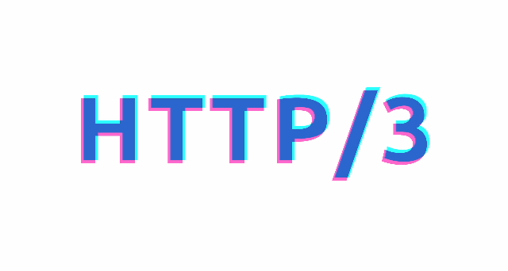

## 重磅消息

Req 即将引入 HTTP3 支持。为了支持HTTP3，req 的内部代码进行了一些重构，所以目前代码在单独的 http3 分支上提交。 等到足够稳定后，会合并到主分支，然后发布版本`v3.14.0`。

距正式发布还需要一段时间，不过现在大家已经可以提前尝鲜试用，本文将介绍如何在 req 中使用 HTTP3。

## 安装

如果要启用 HTTP3 支持，请确保您的 go 版本在 go1.16 和 go1.18 之间，然后您可以使用以下 Go 命令安装支持 HTTP3 的 req：

```bash
go get -u github.com/imroc/req/v3@http3
```

## 用法

调用 client 的 `EnableHTTP3()` 来启用 HTTP3 的支持:

```go
package main

import (
  "github.com/imroc/req/v3"
)

func main() {
  req.EnableDebugLog().EnableHTTP3()
  // req.EnableDumpAll() // uncomment this to see all dump content.

  for i := 0; i < 4; i++ {
    req.MustGet("https://www.cloudflare.com")
  }
}
```

看看 debug 日志的输出:

```
2022/07/02 10:37:52.876009 DEBUG [req] HTTP/2 GET https://www.cloudflare.com
2022/07/02 10:37:53.029690 DEBUG [req] HTTP/2 GET https://www.cloudflare.com
2022/07/02 10:37:53.122675 DEBUG [req] detected that the server www.cloudflare.com:443 supports http3, will try to use http3 protocol in subsequent requests
2022/07/02 10:37:53.171431 DEBUG [req] HTTP/3 GET https://www.cloudflare.com
2022/07/02 10:37:53.440928 DEBUG [req] HTTP/3 GET https://www.cloudflare.com
```

我来解释一下：启用 HTTP3 的支持后，req 会先正常发起 HTTP2 或 HTTP/1.1 请求（走 TCP）。在请求过程中，如果检测到服务器端支持 HTTP3，那么后续的所有请求都会使用 HTTP3 协议（走 UDP），就跟浏览器的行为是一样的。
